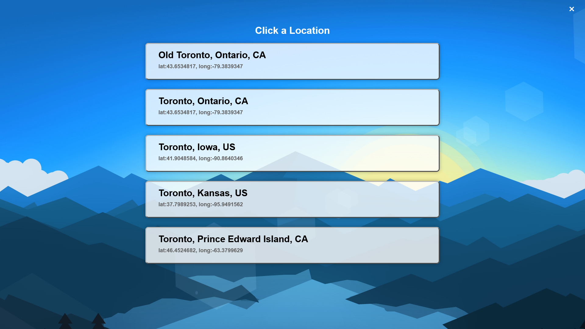
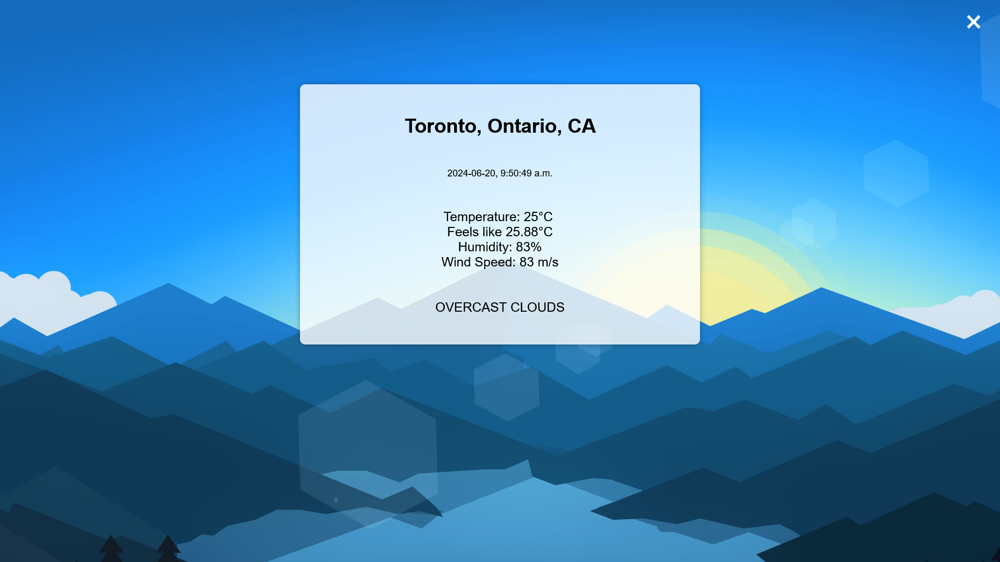

# README

Sign up for OpenWeather API (free account). Copy paste key into main.js underneath `const apiKey`.

Clone the repository and open `index.html`

Enter Location

Click one of the following:

